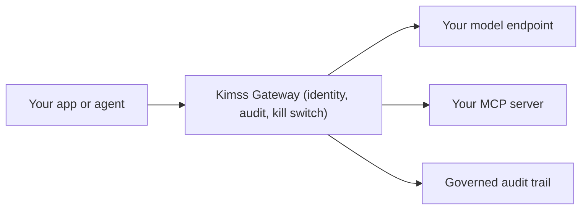

# Route your first governed AI call in 5 minutes

[](https://pypi.org/project/kimss/)
[](https://pypi.org/project/kimss/)

Your company is already building with AI. The problem is that right now it is probably **unmanaged**: provider keys hardcoded in `.env` files, scripts calling models directly, and no record of who made which call. That is Shadow AI — and a chat log cannot tell you who made the call, and it certainly cannot stop the next one.

[Kimss](https://kimss.ai) is a **Secure AI Gateway** and **Governance Control Plane**. Every AI request routes through one door where identity, audit trails, and a kill switch actually live. Kimss never hosts your models and never charges for inference compute — you bring your own endpoints (**BYOI**), Kimss governs the traffic.

**30-second drop-in:**

```python
from openai import OpenAI
client = OpenAI(api_key="kimss_...", base_url="https://api.kimss.ai/v1")
```

```bash
OPENAI_BASE_URL="https://api.kimss.ai/v1"
OPENAI_API_KEY="kimss_..."
```

Step-by-step: [GETTING_STARTED.md](GETTING_STARTED.md). AI assistants: [docs/KIMSS_ONBOARDING.md](docs/KIMSS_ONBOARDING.md).

This repo is a strict 5-minute tutorial: route one local call through the Kimss gateway and see it land in your governed audit trail.



---

## Step 1 — Get your free API key

> **To route traffic, you must create a free control plane namespace. Get your API key at [kimss.ai](https://kimss.ai/app/signup) (25,000 governed requests/mo included. No credit card).**

1. **[Create Free Account →](https://kimss.ai/app/signup)** — the Developer tier is **always free**: 25,000 governed requests/month, 14-day telemetry retention, no expiration cliff.
2. After signup you land on the **Gateway** tab. Click **Generate Key** and copy the `kimss_...` key once — it is shown a single time. The same keys are listed under **Governance → API Keys**.

## Step 2 — Vault your provider key in the Kimss UI

Kimss governs traffic to endpoints **you** own. Hand the gateway your OpenAI / Anthropic / Azure OpenAI key once, then delete it from your local `.env` files:

1. In the app, open **Governance → Connected Infrastructure** (`/app/governance/custom-models`).
2. Add your provider endpoint + key. It is stored vaulted and is never returned to clients.
3. Back on the **Gateway** tab, copy your `agent_id` — the identity every governed call is attributed to.

## Step 3 — Run the local proxy script

```bash
git clone https://github.com/eyal81/kimss-python-quickstart.git
cd kimss-python-quickstart
pip install -r requirements.txt
cp .env.example .env   # set KIMSS_API_KEY and KIMSS_AGENT_ID
python example_01_gateway_proxy.py
```

The script routes a completion through `https://api.kimss.ai` with your `X-Kimss-Key`. Nothing goes to the provider directly — the gateway checks identity, applies policy, records the call, then forwards to your vaulted endpoint.

## Step 4 — See the governed audit trail

Open your dashboard:

- **Gateway → Recent calls** — the request you just sent, attributed to your `agent_id`.
- **Governance → Audit Trail** (`/app/governance/audit-log`) and **Telemetry** (`/app/governance/telemetry`) — who called, which agent, when, and the outcome. Free tier keeps 14 days of telemetry.

That is the difference between a chat log and a control plane: the record is **gateway-verified**, not a self-report.

---

## The scripts

| Script | What it proves |
|--------|----------------|
| [`example_01_gateway_proxy.py`](example_01_gateway_proxy.py) | Route a local call through the Kimss gateway with `X-Kimss-Key`; print the governed response |
| [`example_02_openai_override.py`](example_02_openai_override.py) | Zero-rewrite adoption: point the official `openai` client at `https://api.kimss.ai/v1` |
| [`example_03_kill_switch_and_429.py`](example_03_kill_switch_and_429.py) | What enforcement looks like in code: kill-switch refusals and the `429 governed_requests_exhausted` hard cap |

## What governance looks like in code

| Concern | What you see |
|---------|--------------|
| Identity | Every call carries `X-Kimss-Key` and is mapped to a registered `agent_id` |
| Kill switch | Disable an agent in **Governance → Agents** and its routed calls are refused instantly |
| Monthly allowance | Free tier hard-caps at 25,000 governed requests/month — over-cap calls return `429` with `error: governed_requests_exhausted` |
| Audit trail | Gateway-verified telemetry in the dashboard; 14-day retention on the free tier |

## Troubleshooting

| Symptom | Fix |
|---------|-----|
| `401` / key rejected | Use the `X-Kimss-Key` header (the SDK does this for `api_key=`). Do not send Kimss keys as `Authorization: Bearer` outside the OpenAI-compatible `/v1` path |
| `governed_requests_exhausted` (429) | Monthly free allowance reached. The meter resets next month, or upgrade at [kimss.ai/pricing](https://kimss.ai/pricing) |
| Agent refused / disabled | The kill switch is on for that `agent_id` — re-enable it under **Governance → Agents** |
| No `agent_id` yet | Open **Gateway → Register external agent**, give it a name, done |

## Related

- SDK source / docs: [eyal81/kimss-python-sdk](https://github.com/eyal81/kimss-python-sdk) · PyPI: [kimss](https://pypi.org/project/kimss/)
- Product: [kimss.ai](https://kimss.ai) · [Pricing](https://kimss.ai/pricing)

*Free tier includes 25,000 governed requests/month. No credit card required.*

## License

MIT — see [LICENSE](LICENSE).
